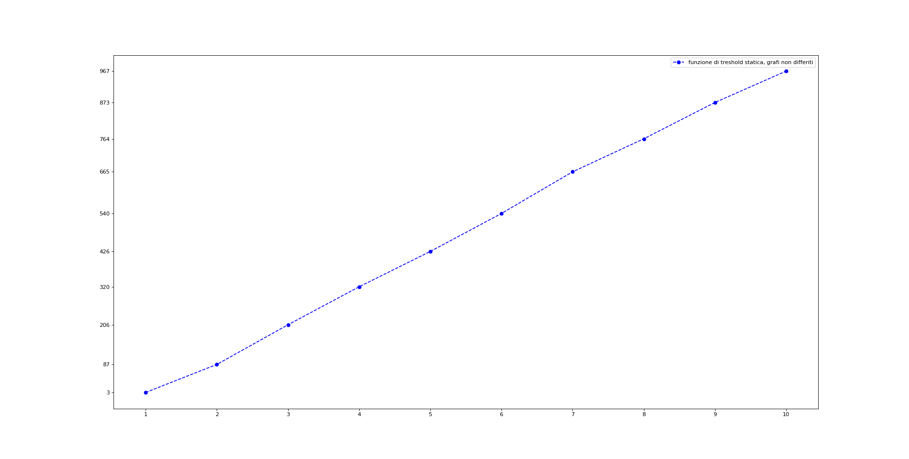
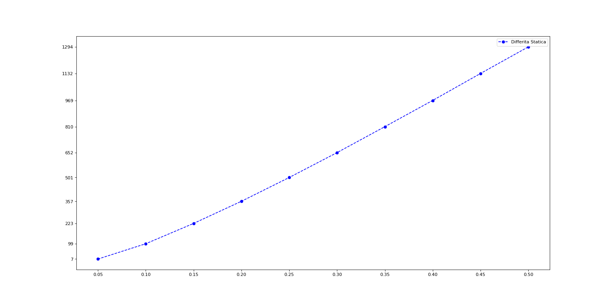
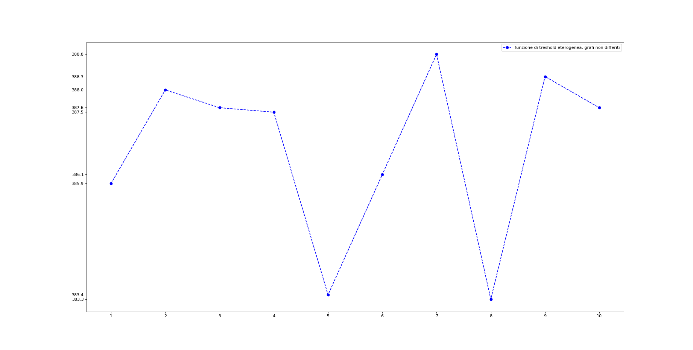
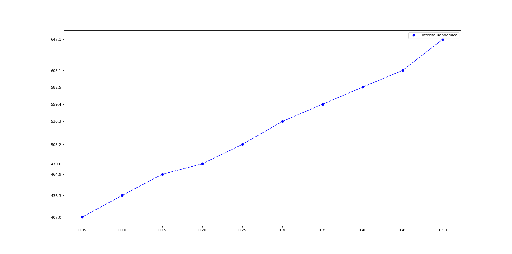
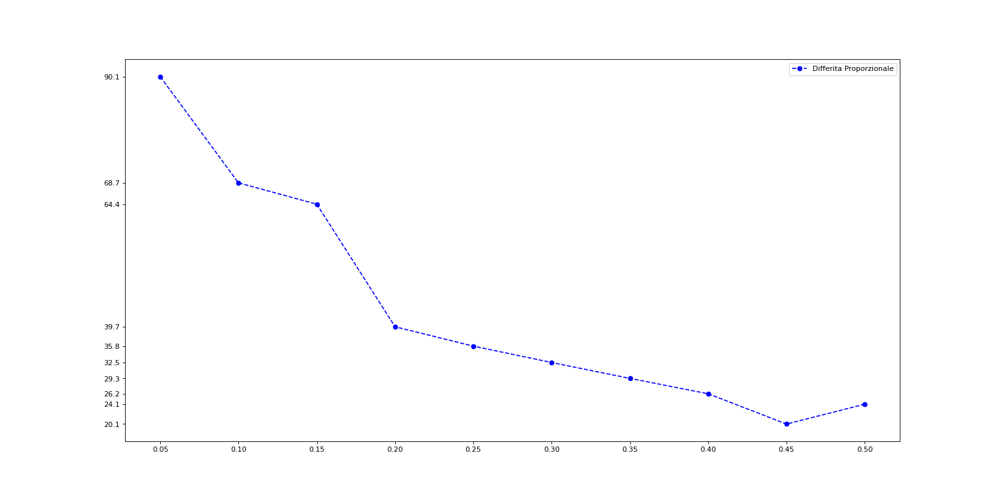

# **Target Set Selection Problem**
Progetto di corso per l'esame di **Reti sociali 2021/22**.

- Studenti: **Gaetano Casillo**, **Simona Pentangelo**, **Gabriele Pisapia**
- Data di consegna: **-**  
___
## Sommario
- [**Target Set Seceltion**](#target-set-selection)
  - [Sommario](#sommario)
  - [Introduzione](#introduzione)
  - [Studio effettuato](#studio-effettuato)
  - [Dettagli implementativi](#dettagli-implementativi)
    - [Informazioni dei nodi](#informazioni-dei-nodi)
    - [Inizializzazione dei threshold](#inizializzazione-dei-threshdold)
    - [Principio di decisione differita](#principio-di-decisione-differita)
    - [Algoritmo di Target Set Selection](#algoritmo-di-target-set-selection)
  - [Risultati](#risultati)
    - [Threshold costante](#threshold-costante)
    - [Threshold eterogeneo](#threshold-eterogeneo)
    - [Threshold a maggioranza](#threshold-a-maggioranza)
    - [Threshold proporzionale al grado](#threshold-proporzionale-al-grado)
  - [Conclusioni](#conclusioni)
___
## Introduzione
Il problema del **Target Set Selection (TSS)** consiste nel trovare, all'interno dei nodi di una rete, il più piccolo insieme di nodi i quali permettano di condizionare l'intera rete. Formalmente, dato un grafo G=(V, E), in cui per ogni vertice v, *d(v)* indica il grado del vertice e *t(v)* indica il threshold associato al vertice (ovvero, il numero minimo di adiacenti attivi di v necessari per influenzare v), il suo target set S è un insieme di nodi tali che attiveranno l'intera rete, ovvero, per il quale si verifica Influenced[S, ℓ]=V, per qualche ℓ ≥ 0.

Il lavoro da noi svolto ha l'obiettivo di confrontare le dimensioni dei target set ottenuti sul dataset formato dalle [friend-list su Facebook](http://snap.stanford.edu/data/ego-Facebook.html) ed utilizzando l'algoritmo descritto nel paper [*Discovering Small Target Sets in Social Networks: A Fast and Effective Algorithm*](https://arxiv.org/abs/1610.03721).
___
## Studio effettuato
Abbiamo deciso di confrontare i target set ottenuti con diverse modalità di inizializzazione dei threshold:

 - *Costante (omogeneo)*
 - *Eterogeneo*
 - *A maggioranza*
 - *Proporzionale al grado*

Per ogni modalità, abbiamo eseguito prima l'algoritmo sul grafo originario, poi l'abbiamo eseguito sul grafo ottenuto utilizzando il *principio di decisione differita*, ovvero: per ogni arco del grafo viene generato un numero pseudocasuale compreso tra 0 e 1. 
Se il numero generato è minore della probabilità presente sull'arco (cioè il nodo infetta con una probabilità inferiore rispetto a quella richiesta), l'arco viene rimosso.
Il grafo così ottenuto viene dato in input all'algoritmo scelto, che calcola
l’insieme soluzione e lo restituisce in output.
___
## Dettagli implementativi 

Per lavorare con il dataset disponibile su [SNAP](http://snap.stanford.edu/index.html), abbiamo utilizzato il linguaggio **Python** e il modulo [Snap.py](https://snap.stanford.edu/snappy/doc/reference/index-ref.html).

```python
(G, Map)= snap.LoadEdgeListStr(snap.TUNGraph, "facebook_combined.txt", 0, 1, True)
```

### Informazioni dei nodi 

Tramite il modulo **Snap.py**, abbiamo raccolto tutte le informazioni dei nodi. Abbiamo deciso di utilizzare il dizionario `informazioni_nodi` per poter accedere facilmente al grado, al threshold e all'insieme dei vicini di un determinato nodo. 

Per poter ottenere le informazioni desiderate, basta utilizzare il nodo di interesse come chiave.

```python
#Per ogni nodo del grafo
for i in G.Nodes():
        #dizionario con le informazioni dei nodi
        temporaneo={"vicini":"","degree":"","t":""}
        lista=[]
        #per ogni vicino del nodo corrente
        for b in range(0,i.GetDeg()):
            #crea la lista dei nodi adiacenti
            lista.append(i.GetNbrNId(b))
        temporaneo["vicini"]=lista
        temporaneo["degree"]=i.GetDeg()
        temporaneo["t"]=#inserire qui la funzione di threshold
        informazioni_nodi[i.GetId()]=temporaneo
```

### Inizializzazione dei threshold

Abbiamo deciso di eseguire l'algoritmo utilizzando diverse configurazioni per i threshold:
  + Senza principio di decisione differita
    - Threshold deterministico: soglie da 1 a 10
    - Threshold eterogeneo: seed = 42
    - Threshold a maggioranza: gradi originali dei nodi
  + Con principio di decisione differita: probabilità da 0.05 a 0.5
    - Threshold deterministico: soglie da 1 a 10
    - Threshold eterogeneo: seed = 42
    - Threshold a maggioranza: gradi originali dei nodi
    - Threshold proporzionale al grado: gradi originali dei nodi

Per quelli con principio di decisione differita, abbiamo eseguito 10 volte l'update del grafo e l'esecuzione dell'algoritmo. Una volta completate le 10 esecuzioni, sono state calcolate le medie relative alla taglia del target set e al tempo di esecuzione (in secondi).

```python
for i in range(1, 11):
        soglia = i #da 1 a 10
        prob +=0.05 #da 0.05 a 0.5, incrementando di 0.05 alla volta
        prob = round(prob, 2)
        for j in range(0, 10):
            compute(j, G)
```

Qui di seguito sono state riportate tutte le funzioni utilizzate per inizializzare i threshold:

 - Threshold deterministico
    
    La variabile `soglia` è globale, viene modificata ad ogni iterazione e la funzione restituisce il valore dell'iterazione corrente.
    ```python
    def staticthreshold():
        return soglia #variabile globale
    ```
- Threshold eterogeneo
    
    Il seed utilizzato è 42.
    ```python
    def randomthreshold():
        return random.randint(1,10)
    ```

- Threshold a maggioranza

    ```python
    def maggioranzathreshold(degree):
        return round(degree * (1/2))
    ```

- Threshold proporzionale al grado

    ```python
    def proportionalthreshold(degree):
        return round(degree * (1/(2+staticthreshold())))
    ```

### Principio di decisione differita

Qui di seguito, l'algoritmo che abbiamo utilizzato per eliminare gli archi dal grafo tramite il principio di decisione differita: 

```python
def differita(G):
    for i in G.Edges():
      #Se all'i-esima iterazione il valore ottenuto è < prob
        if random.random() < prob:
          #l'arco i-esimo viene rimosso del grafo
            G.DelEdge(i.GetSrcNId(),i.GetDstNId())
```
La probabilità `prob` è una variabile globale che viene modificata prima delle 10 esecuzioni per ogni funzione di threshold. Inizialmente è 0.05, viene incrementata di 0.05 ogni volta fino a 0.5.

### Algoritmo di Target Set Selection 

La funzione `compute(j)` implementa l'algoritmo TSS. Una volta caricato il grafo, viene chiamata la funzione per applicare il principio di decisione differita (se necessaria, altrimenti è necessario commentarla) e [viene riempito il dizionario](#informazioni-dei-nodi) `informazioni_nodi`, dopo di che si itera per ogni nodo del grafo.

```python
def compute(j):
    (G, Map)= snap.LoadEdgeListStr(snap.TUNGraph, "facebook_combined.txt", 0, 1, True)
    differita(G) #principio di diffusione differita
    
    #SNIP, qui c'è il ciclo for per riempire il dizionario informazioni_nodi

    while len(informazioni_nodi.keys())!=0:
        for nodo in informazioni_nodi.keys():
            #Caso 1: c'è un nodo con t = 0 
            if (informazioni_nodi[nodo]["t"] == 0):
                flag_case1=True
                eliminato=nodo
                for vicino in informazioni_nodi[nodo]["vicini"]:
                    informazioni_nodi[vicino]["t"]=informazioni_nodi[vicino]["t"] - 1 if informazioni_nodi[vicino]["t"] - 1 > 0 else 0
                break
        if not flag_case1:
            for nodo in informazioni_nodi.keys():
                #Caso 2:c'è un nodo con degree < t
                if informazioni_nodi[nodo]["degree"] < informazioni_nodi[nodo]["t"]:
                    eliminato=nodo
                    flag_case2=True
                    TSet.append(nodo) #aggiunta al target set
                    for vicino in informazioni_nodi[nodo]["vicini"]:
                        informazioni_nodi[vicino]["t"]=informazioni_nodi[vicino]["t"] - 1

                    break
            if not flag_case2:
                #Se non si sono verificati i casi precedenti
                eliminato=caso3(informazioni_nodi)
        
        for nodo in informazioni_nodi[eliminato]["vicini"]:
            
            informazioni_nodi[nodo]["degree"]=informazioni_nodi[nodo]["degree"]-1
            
            informazioni_nodi[nodo]["vicini"].remove(eliminato)
            
        #Elimino il nodo designato dal grafo
        informazioni_nodi.pop(eliminato)
        flag_case1=False
        flag_case2=False
    #Alla decima iterazione, abbiamo scritto nel file i valori medi
    if j == 9:
        f = open(output_file_result, 'a')
        f.write("Soglia: ")
        f.write(str(soglia))
        f.write("\n")
        f.write("Probabilità: ")
        f.write(str(prob))
        f.write("\n")
        f.write("Tempo (media): ")
        f.write(str(media_tempo/10))
        f.write("\n")
        f.write("Lunghezza di Tset (media): ")
        f.write(str(media_risultati/10))
        f.write("\n\n")
        f.close
        reset_globvar()
    else:
        update_globvar(len(TSet), time.time() - start_time)
```
Nel caso 1 verifichiamo che nessun nodo nel dizionario abbia threshold uguale ad 0, se viene trovato un nodo la variabile `eliminato` viene aggiornata con il nodo selezionato. I vicini del nodo selezionato avranno il threshold decrementato di 1, se la soglia aggiornata dovesse essere negativa, viene impostata a 0.
Nel caso 2 verifichiamo che nessun nodo nel dizionario abbia il proprio degree minore del proprio threshold, se viene trovato un nodo la variabile `eliminato` viene aggiornata con il nodo selezionato. Tale nodo viene aggiunto al target set e i vicini avranno il threshold decrementato di 1.  


Per il caso 3, abbiamo utilizzato una funzione:

```python
def caso3(dizionario):
    #il primo nodo è il nostro massimo iniziale
    chiave = list(dizionario.keys())[0]
    #threshold/[degree*(degree+1)]
    massimo= dizionario[chiave]["t"]/((dizionario[chiave]["degree"])*((dizionario[chiave]["degree"])+1))
    for chiavi in dizionario.keys():
        temporaneo= dizionario[chiavi]["t"]/((dizionario[chiavi]["degree"])*((dizionario[chiavi]["degree"])+1))
        if temporaneo>massimo:
            chiave=chiavi
            massimo=temporaneo
    #quello che ottiene il valore massimo alla funzione, sarà eliminato dal grafo
    return chiave
```

Una volta inizializzate le variabili `chiave` e `massimo` con i risultait ottenuti dal primo nodo disponibile, itera per tutti i nodi presenti nel grafo, aggiornando le variabili qualora un nodo ottenga un valore maggiore come risultato della funzione *threshold/[degree\*(degree+1)*. Una volta completato il ciclo, viene restituito il nodo che ha ottenuto il risultato maggiore. 
___ 

## Risultati

### Threshold costante

*Senza principio di decisione differita*             |  *Con principio di decisione differita*
:-------------------------:|:-------------------------:
  |  

| Soglie | 1 | 2 | 3 | 4 | 5 | 6 | 7 | 8 | 9 | 10 |
| ---- | ---- | ---- | ---- | ---- | ---- | ---- | ---- | ---- | ---- | ---- |
| Grafo non differito | 3 | 87 | 206 | 320 | 426 | 540 | 665 | 764 | 873 | 967 |

| Probabilità | 0.05 | 0.10 | 0.15 | 0.20 | 0.25 | 0.30 | 0.35 | 0.40 | 0.45 | 0.50 |
| --- | --- | --- | --- | --- | --- | --- | --- | --- | --- | --- |
| Grafo differito | 7 | 99 | 223 | 357 | 501 | 652 | 810 | 969 | 1132 | 1294 |  

### Threshold eterogeneo

*Senza principio di decisione differita*             |  *Con principio di decisione differita*
:-------------------------:|:-------------------------:
  |  

### Threshold a maggioranza

*Con principio di decisione differita* |
| :------------------------- |
 |

### Threshold proporzionale al grado

*Con principio di decisione differita* |
| :------------------------- |
 |

___  

## Conclusioni  


___