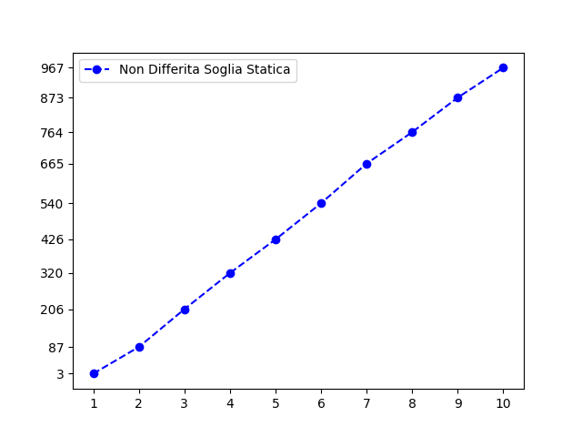
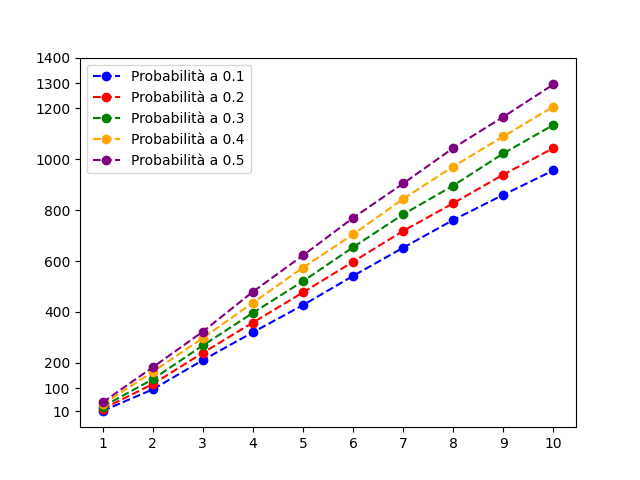
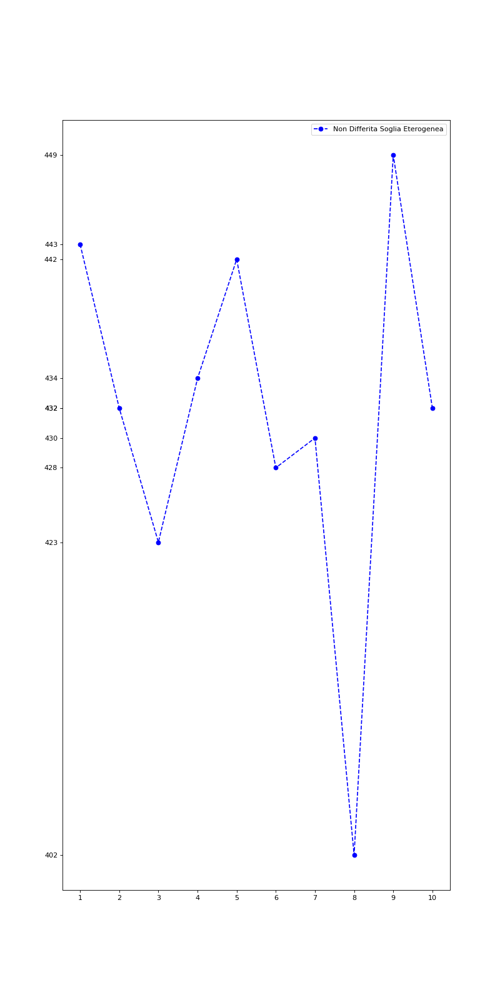
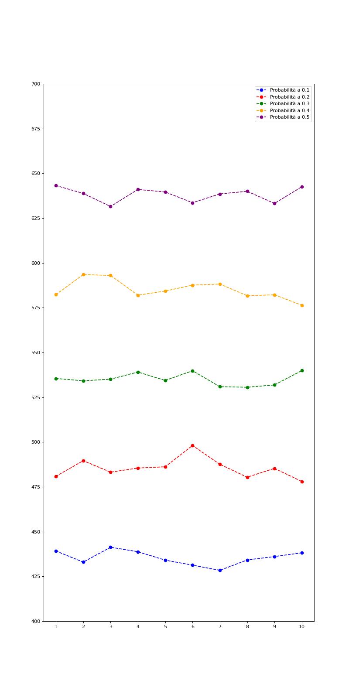
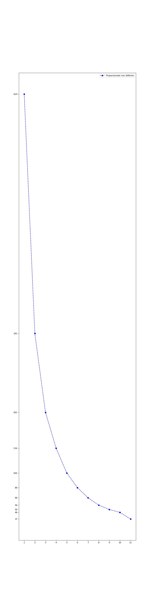
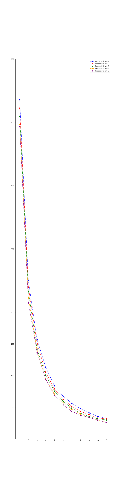

# **Target Set Selection Problem**
Progetto di corso per l'esame di **Reti sociali 2021/22**.

- Studenti: **Gaetano Casillo**, **Simona Pentangelo**, **Gabriele Pisapia**
___

## Sommario
- [**Target Set Seceltion**](#target-set-selection)
  - [Sommario](#sommario)
  - [Introduzione](#introduzione)
    - [Dataset](#dataset)
  - [Studio effettuato](#studio-effettuato)
  - [Dettagli implementativi](#dettagli-implementativi)
    - [Cos'è presente in questa repository](#cos-è-presente-in-questa-repository)
    - [Inizializzazione dei threshold](#inizializzazione-dei-threshdold)
    - [Principio di decisione differita](#principio-di-decisione-differita)
    - [Algoritmo di Target Set Selection](#algoritmo-di-target-set-selection)
  - [Risultati](#risultati)
    - [Threshold costante](#threshold-costante)
    - [Threshold eterogeneo](#threshold-eterogeneo)
    - [Threshold a maggioranza e proporzionale al grado](#threshold-a-maggioranza-e-proporzionale-al-grado)
  - [Conclusioni](#conclusioni)
___

## Introduzione
Il problema del **Target Set Selection (TSS)** consiste nel trovare, all'interno dei nodi di una rete, il più piccolo insieme di nodi i quali permettano di condizionare l'intera rete. Formalmente, dato un grafo G=(V, E), in cui per ogni vertice v, *d(v)* indica il grado del vertice e *t(v)* indica il threshold associato al vertice (ovvero, il numero minimo di adiacenti attivi di v necessari per influenzare v), il suo target set S è un insieme di nodi tali che attiveranno l'intera rete, ovvero, per il quale si verifica Influenced[S, ℓ]=V, per qualche ℓ ≥ 0.

Il lavoro da noi svolto ha l'obiettivo di confrontare le dimensioni dei target set ottenuti sul dataset formato dalle [friend-list su Facebook](http://snap.stanford.edu/data/ego-Facebook.html) ed utilizzando l'algoritmo descritto nel paper [*Discovering Small Target Sets in Social Networks: A Fast and Effective Algorithm*](https://arxiv.org/abs/1610.03721).

### Dataset

Questo dataset consiste nelle "cerchie" (o friend-lists) di Facebook. I dati sono stati raccolti tramite i partecipanti ad un sondaggio, utilizzando l'app di Facebook. Il dataset include le caratteristiche dei nodi (profili), le cerchie e gli *ego networks*, ovvero reti costituite di un nodo focale ("ego"), dei nodi ai quali l'ego è direttamente connesso (detti "alters") e dei collegamenti, se presenti, tra gli alters.

I dati sono stati anonimizzati rimpiazzando gli id interni di Facebook con un nuovo valore. Inoltre, dal momento che sono stati forniti i vettori contenenti le varie features di questo dataset, l'interpretazione di queste caratteristiche è stata anonimizzata. Per esempio, se nel dataset originale la caratteristica *political=Democratic Party"*, il nuovo valore per questa feature conterrebbe semplicemente *political=anonymized feature 1*. Con i dati anonimizzati, è possibile determinare se due utenti hanno le stesse affiliazioni politiche, ma non è possibile sapere le effettive affiliazioni dei singoli indvidui.

| Caratteristiche | Nodi | Archi | Coefficente medio di clustering | 
| ---- | ---- | ---- | ---- | 
| Valori | 4039 | 88234 | 0.6055 |
___

## Studio effettuato

Abbiamo deciso di confrontare i target set ottenuti con diverse modalità di inizializzazione dei threshold:

 - *Costante (omogeneo)*
 - *Eterogeneo*
 - *A maggioranza*
 - *Proporzionale al grado*

Per ogni modalità, abbiamo eseguito prima l'algoritmo sul grafo originario, poi l'abbiamo eseguito sul grafo ottenuto utilizzando il *principio di decisione differita*, ovvero: per ogni arco del grafo viene generato un numero pseudocasuale compreso tra 0 e 1. 
Se il numero generato è minore della probabilità presente sull'arco (cioè il nodo infetta con una probabilità inferiore rispetto a quella richiesta), l'arco viene rimosso.
Il grafo così ottenuto viene dato in input all'algoritmo scelto, che calcola
l’insieme soluzione e lo restituisce in output.
___

## Dettagli implementativi 

### Cos'è presente in questa repository

I file contenenti l'algoritmo TSS sono rispettivamente **tss_final_vers.py**, che abbiamo utilizzato per generare i risultati senza principio di decisione differita, e **tss_final_diff.py**, che abbiamo utilizzato per generare i risultati con principio di decisione differita.

Per lavorare con il dataset disponibile su [SNAP](http://snap.stanford.edu/index.html), abbiamo utilizzato il linguaggio **Python** e il modulo [Snap.py](https://snap.stanford.edu/snappy/doc/reference/index-ref.html), il quale ci ha permesso non solo di caricare il grafo, ma anche di accedere alle varie informazioni utili ai fini dell'algoritmo, come il degree dei nodi ed il neighborhood di un nodo.

Abbiamo utilizzato il file *facebook_combined.txt* per caricare il grafo.

```python
(G, Map) = snap.LoadEdgeListStr(snap.TUNGraph, "facebook_combined.txt", 0, 1, True)
```
I file di output generati dai nostri script sono situati nella cartella *file_output*, i valori presenti su questi file di testo, sono stati utilizzati come input dello script **grafici.py** per generare i grafici relativi ai target set trovati e sono situati nella cartella *risultati*.

La cartella *python_test* contiene vari file e script che ci sono stati utili in fase di testing.

### Inizializzazione dei threshold

Abbiamo deciso di eseguire l'algoritmo utilizzando diverse configurazioni per i threshold:
  + Senza principio di decisione differita
    - Threshold deterministico: soglie da 1 a 10
    - Threshold eterogeneo: seed = 42
    - Threshold a maggioranza: gradi originali dei nodi
    - Threshold proporzionale al grado: gradi originali dei nodi e con frazioni da 1/3 ad 1/12
  + Con principio di decisione differita: probabilità da 0.1 a 0.5
    - Threshold deterministico: soglie da 1 a 10
    - Threshold eterogeneo: seed = 42
    - Threshold a maggioranza: gradi del nuovo grafo
    - Threshold proporzionale al grado: gradi del nuovo grafo e con frazioni da 1/3 ad 1/13

Per quelli con principio di decisione differita, abbiamo eseguito 10 volte l'update del grafo e l'esecuzione dell'algoritmo. Una volta completate le 10 esecuzioni, è stata calcolata la relativa alla taglia del target set. Qui abbiamo riportato il codice utilizzato per invocare le funzioni per il TSS.

```python
''' TEST NON DIFFERITA'''
for j in range(0, 10):
    (G, Map)= snap.LoadEdgeListStr(snap.TUNGraph, "facebook_combined.txt", 0, 1, True)
    soglia = 1
    iniziathold(G) #Inizializzazione dei threshold
    targetsetsel(G)
    thold = []

''' TEST DIFFERITA'''
for i in range(0, 5):
        prob += 0.1
        prob = round(prob, 2)
        for j in range(0, 10):
            soglia = j + 1
            for k in range (0,10):
                (G, Map)= snap.LoadEdgeListStr(snap.TUNGraph, "facebook_combined.txt", 0, 1, True)
                differita(G) #Principio di decisione differita
                iniziathold(G) #Inizializzazione dei threshold
                targetsetseldiff(G,k)
                thold = []

```

Qui di seguito è stata riportata la funzione utilizzata per salvare il threshold per ognuno dei nodi del grafo:

```python
def iniziathold(G):
    for nodo in G.Nodes():
        #Salvataggio della soglia per il nodo corrente
        thold.append('''chiamata a funzione di threshold di interesse''')
```

Tale funzione, effettua la chiamata ad una specifica funzione di threshold per ottenere il valore di soglia per il nodo corrente. 

 - Threshold deterministico
    
    La variabile `soglia` è globale, viene modificata ad ogni iterazione e la funzione restituisce il valore dell'iterazione corrente.
    ```python
    def staticthreshold():
        return soglia #variabile globale
    ```
- Threshold eterogeneo
    
    Il seed utilizzato è 42.
    ```python
    def randomthreshold():
        return random.randint(1,10) #seed a 42
    ```

- Threshold a maggioranza

    ```python
    def maggioranzathreshold(degree):
        return round(degree * (1/2))
    ```

- Threshold proporzionale al grado

    ```python
    def proportionalthreshold(degree):
        return round(degree * (1/(2+staticthreshold()))) #da 1/3 ad 1/11
    ```

### Principio di decisione differita

Qui di seguito, l'algoritmo che abbiamo utilizzato per eliminare gli archi dal grafo tramite il principio di decisione differita: 

```python
def differita(G):
    for i in G.Edges():
      #Se all'i-esima iterazione il valore ottenuto è < prob
        if random.random() < prob:
          #l'arco i-esimo viene rimosso del grafo
            G.DelEdge(i.GetSrcNId(),i.GetDstNId())
```
La probabilità `prob` è una variabile globale che viene modificata prima delle 10 esecuzioni per ogni funzione di threshold. Inizialmente è 0.1, viene incrementata di 0.1 ogni volta fino a 0.5.

### Algoritmo di Target Set Selection 

Le funzioni `tergetsetsel(G)` e `tergetsetseldiff(G, k)` implementano l'algoritmo TSS. Una volta caricato il grafo, viene chiamata una delle due funzioni (la seconda nel caso in cui venga applicato il principio di decisione differita) e si itera per ogni nodo del grafo.

- Senza principio di decisione differita

    ```python
    def targetsetsel(G):
                targetset=[]
                while G.GetNodes() != 0:
                    eliminato = None
                    for nodo in tqdm(G.Nodes()):
                        if thold[nodo.GetId()] == 0: #CASO 1
                            for vicino in nodo.GetOutEdges():
                                thold[vicino] = thold[vicino] - 1 if thold[vicino] - 1 > 0 else 0 #Update delle soglie
                            eliminato = nodo.GetId()
                            G.DelNode(eliminato) #Eliminazione del nodo dal grafo
                        else:
                            if thold[nodo.GetId()] > nodo.GetOutDeg(): #CASO 2
                                targetset.append(nodo.GetId()) #Salvataggio nel target set
                                eliminato = nodo.GetId()
                                for vicino in nodo.GetOutEdges():
                                    thold[vicino] = thold[vicino] - 1 if thold[vicino] - 1 > 0 else 0 #Update delle soglie
                                G.DelNode(eliminato) #Eliminazione del nodo dal grafo
                    if eliminato == None:
                        eliminato = caso3(G)
                        G.DelNode(eliminato)
                #Salvataggio dei risultati
                f = open(output_file_result, 'a')
                f.write("Soglia: ")
                f.write(str(soglia))
                f.write("\n")
                f.write("Lunghezza di Tset: ")
                f.write(str(len(targetset)))
                f.write("\n\n")
                f.close
    ```

- Con principio di decisione differita

    ```python     
            def targetsetseldiff(G, k):
                targetset=[]
                while G.GetNodes() != 0:
                    eliminato = None
                    for nodo in tqdm(G.Nodes()):
                        if thold[nodo.GetId()] == 0: #CASO 1
                            for vicino in nodo.GetOutEdges():
                                thold[vicino] = thold[vicino] - 1 if thold[vicino] - 1 > 0 else 0 #Update delle soglie
                            eliminato = nodo.GetId()
                            G.DelNode(eliminato) #Eliminazione del nodo dal grafo
                        else:
                            if thold[nodo.GetId()] > nodo.GetOutDeg(): #CASO 2
                                targetset.append(nodo.GetId()) #Salvataggio nel target set
                                eliminato = nodo.GetId()
                                for vicino in nodo.GetOutEdges():
                                    thold[vicino] = thold[vicino] - 1 if thold[vicino] - 1 > 0 else 0 #Update delle soglie
                                G.DelNode(eliminato) #Eliminazione del nodo dal grafo
                    if eliminato == None:
                        eliminato = caso3(G) #CASO 3 (funzione apposita)
                        G.DelNode(eliminato) #Eliminazione del nodo dal grafo
                if k == 9: #Salvataggio dei risultati (dopo 10 iterazioni)
                    f = open(output_file_result, 'a')
                    f.write("Soglia: ")
                    f.write(str(soglia))
                    f.write("\n")
                    f.write("Prob: ")
                    f.write(str(prob))
                    f.write("\n")
                    f.write("Lunghezza di Tset (media): ")
                    f.write(str(media_risultati/10) #Calcolo della media
                    f.write("\n\n")
                    f.close
                else: #Salvataggio per calcolare la media (non ho ancora finito le 10 iterazioni)
                    update_globvar(len(targetset))
                    print_globvar()
    ```       

Nel caso 1, se il nodo corrente nel grafo ha soglia 0, la variabile `eliminato` viene aggiornata con il nodo selezionato, i vicini del nodo selezionato avranno il threshold decrementato di 1, se la soglia aggiornata dovesse essere negativa, viene impostata a 0 e infine il nodo `eliminato` viene cancellato dal grafo.
Nel caso 2, se il nodo corrente nel grafo **non** ha soglia 0 e il proprio degree è minore del proprio threshold, la variabile `eliminato` viene aggiornata con il nodo selezionato. Tale nodo viene aggiunto al `targetset`, i vicini del nodo selezionato avranno il threshold decrementato di 1, se la soglia aggiornata dovesse essere negativa, viene impostata a 0 e infine il nodo `eliminato` viene cancellato dal grafo.

Per il caso 3, abbiamo utilizzato una funzione:

```python
def caso3(G):
    chiave = -1
    massimo = -1
    for chiavi in G.Nodes():
        #threshold / [ grado del nodo corrente * (grado del nodo corrente + 1) ]
        temporaneo = thold[chiavi.GetId()]/(chiavi.GetOutDeg() * (chiavi.GetOutDeg() + 1))
        if temporaneo > massimo: #Sostituzione del massimo
            chiave = chiavi.GetId()
            massimo = temporaneo
    return chiave #Restituzione del massimo
```

Una volta inizializzate le variabili `chiave` e `massimo`, itera per tutti i nodi presenti nel grafo, aggiornando le variabili qualora un nodo ottenga un valore maggiore come risultato della funzione *threshold/[degree\*(degree+1)*. Una volta completato il ciclo, viene restituito il nodo che ha ottenuto il risultato maggiore. 

Nel caso in cui utilizziamo il principio di decisione differita, è necessario fare le medie dei risultati ottenuti su 10 grafi diversi e poi scrivere i risultati su file.
Senza principio di decisione differita, i risultati ottenuti ad ogni singola iterazioni vengono scritti sul file.
___ 

## Risultati

### Threshold costante

Osservando i grafici generati, i risultati ottenuti con e senza decisione differita hanno andamento simile: con principio di decisione differita, i target set trovati per ogni soglia sono tendenzialmente più grandi e crescono di dimensione al crescere della probabilità.

*Senza principio di decisione differita*             |  *Con principio di decisione differita*
:-------------------------:|:-------------------------:
  |  

| Soglie | 1 | 2 | 3 | 4 | 5 | 6 | 7 | 8 | 9 | 10 |
| ---- | ---- | ---- | ---- | ---- | ---- | ---- | ---- | ---- | ---- | ---- |
| Grafo non differito | 3 | 87 | 206 | 320 | 426 | 540 | 665 | 764 | 873 | 967 |


| Probabilità | 0.1 | 0.2 | 0.3 | 0.4 | 0.5 |
| ---- | ---- | ---- | ---- | ---- | ---- |
| Soglia = 1 | 11.0 | 18.5 | 27.2 | 36.1 | 44.3 |
| Soglia = 2 | 95.2 | 115.9 | 134.9 | 164.0| 182.2 |
| Soglia = 3 | 210.3 | 239.1 | 268.1 | 297.3 | 322.2 |
| Soglia = 4 | 320.0 | 358.1 | 396.1 | 435.9 | 479.3 |
| Soglia = 5 | 426.8 | 476.5 | 520.7 | 574.2 | 622.2 |
| Soglia = 6 | 541.6 | 597.3 | 654.4 | 704.8 | 769.6 |
| Soglia = 7 | 652.5 | 718.5 | 783.7 | 844.7 | 905.0 |
| Soglia = 8 | 761.6 | 827.4 | 896.8 | 971.8 | 1044.5 |
| Soglia = 9 | 860.6 | 940.1 | 1023.3 | 1090.1 | 1167.2 |
| Soglia = 10 | 956.5 | 1044.2 | 1135.5 | 1208.6 | 1294.6 |

### Threshold eterogeneo

Osservando i grafici generati, senza e con principio di decisione differita, le taglie dei target set trovati non si discostano molto le une dalle altre, inoltre, all'aumentare della probailità, crescono anche le taglie degli insiemi risultanti.

*Senza principio di decisione differita*             |  *Con principio di decisione differita*
:-------------------------:|:-------------------------:
  |  

| Seed | 42 | 42 | 42 | 42 | 42 | 42 | 42 | 42 | 42 | 42 |
| ---- | ---- | ---- | ---- | ---- | ---- | ---- | ---- | ---- | ---- | ---- |
| Grafo non differito | 443 | 432 | 423 | 434 | 442 | 428 | 430 | 402 | 449 | 432 | 

| Probabilità | 0.1 | 0.2 | 0.3 | 0.4 | 0.5 |
| ---- | ---- | ---- | ---- | ---- | ---- |
| Seed = 42 | 439.2 | 480.9 | 535.5 | 582.3 | 643.2 |
| - | 433.0 | 489.6 | 534.2 | 593.5 | 638.8 |
| - | 441.3 | 483.2 | 535.1 | 593.0 | 631.5 |
| - | 438.8 | 485.5 | 539.1 | 582.0 | 641.0 |
| - | 434.1 | 486.2 | 534.4 | 584.3 | 639.6 |
| - | 431.3 | 498.1 | 539.8 | 587.6 | 633.6 |
| - | 428.4 | 487.6 | 530.9 | 588.2 | 638.5 |
| - | 434.2 | 480.4 | 530.6 | 581.7 | 640.0 |
| - | 436.1 | 485.3 | 531.9 | 582.2 | 633.2 |
| - | 438.2 | 478.0 | 539.9 | 576.4 | 642.5 |

### Threshold a maggioranza e proporzionale al grafo

Osservando i grafici generati, le taglie dei target set diventano sempre più piccole con il diminuire delle frazioni, inoltre, utilizzando il principio di decisione dfferita, i risultati sono migliori rispetto a quelli ottenuti senza decisione differita e migliorano sempre di più al crescere della probabilità. 

*Senza principio di decisione differita*             |  *Con principio di decisione differita*
:-------------------------:|:-------------------------:
  |  

| Frazione | 1/2 | 1/3 | 1/4 | 1/5 | 1/6 | 1/7 | 1/8 | 1/9 | 1/10 | 1/11 | 1/12 |
| ---- | ---- | ---- | ---- | ---- | ---- | ---- | ---- | ---- | ---- | ---- | ---- |
| Grafo non differito | 619 | 291 | 183 | 134 | 100 | 80 | 66 | 56 | 50 | 46 | 37 | 

| Probabilità | 0.1 | 0.2 | 0.3 | 0.4 | 0.5 |
| ---- | ---- | ---- | ---- | ---- | ---- |
| Frazione = 1/2 | 536.1 | 522.9 | 509.9 | 497.0 | 493.5 |
| Frazione = 1/3 | 250.2 | 240.1 | 233.0 | 233.4 | 215.6 |
| Frazione = 1/4 | 157.3 | 151.4 | 142.3 | 139.2 | 136.8 |
| Frazione = 1/5 | 113.5 | 105.4 | 100.5 | 94.3 | 94.8 |
| Frazione = 1/6 | 84.0 | 79.2 | 75.9 | 71.2 | 68.8 |
| Frazione = 1/7 | 67.8 | 62.8 | 59.7 | 57.2 | 54.0 |
| Frazione = 1/8 | 56.6 | 51.7 | 49.0 | 47.1 | 43.8 |
| Frazione = 1/9 | 48.0 | 43.9 | 40.9 | 39.6 | 37.6 |
| Frazione = 1/10 | 41.3 | 38.4 | 35.6 | 34.3 | 34.0 |
| Frazione = 1/11 | 35.9 | 33.3 | 32.0 | 29.9 | 30.1 |
| Frazione = 1/12 | 32.3 | 31.8 | 30.1 | 26.5 | 25.9 |

___  

## Conclusioni  

In conclusione, con threshold costanti ed eterogeneo, le taglie degli insiemi trovati sono risultate più grandi con l'utilizzo del principio di decisione differita rispetto a quelle ottenute senza, inoltre i risultati sono aumentati al crescere della probabilità. Al contrario con threshold a maggioranza e proporzionale al grado, i target set sono diventati più piccoli con l'utilizzo del principio di decisione differita e sempre più piccoli all'aumentare della probabilità.
___